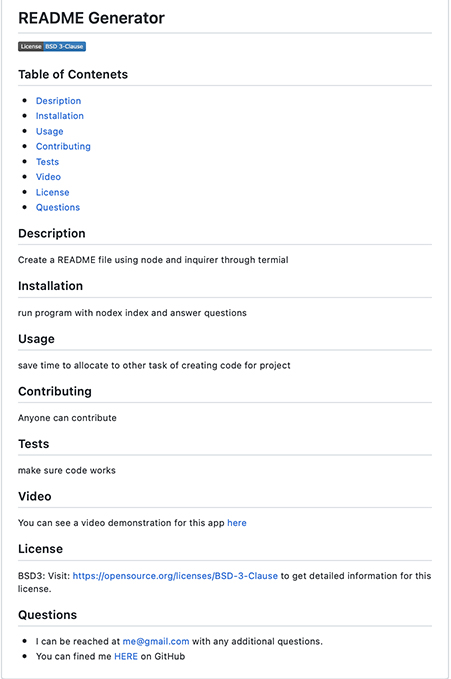

# README Generator
Generate a README file

UCLA Bootcamp Challenge  - Module 9

Due Date 10/18/2022

## Table of Contenets

- [Desription](#Description)
- [User Story](#Story)
- [Requirements](#Requirements)
- [Video](#Video)
- [Questions](#Questions)

## Description
Build a command line application that creates a README file based on the user inputs.

## Story
```md
AS A developer
I WANT a README generator
SO THAT I can quickly create a professional README for a new project
```

## Requirements
- Use command line to accept user inputs
- Use Inquire to prompt for questions
- Questions to be: Title, Description, Installation, Usage, Contribution, and Test information
- As each prompt is answered a coresponding section of README is created
- Prompt with choices for License, once selected icon with license badge to be displayed at the begining of the README and link to more information about the license in the license section.
- Image shows the choices for the license 
- Description section created with Email and github profile links for the project creator
- Image shows all choices for the prompt questions and the final array that holds all answers. 

- The following image shows a mockup of the generated README appearnace.


## Video
You can see a video demonstration for this app [here](https://app.castify.com/view/662a9635-d4c9-4ba1-b040-c6e1c93a1d95)

## Questions
- You can fined me [HERE](https://github.com/Me-ross/readme-generator) on GitHub

